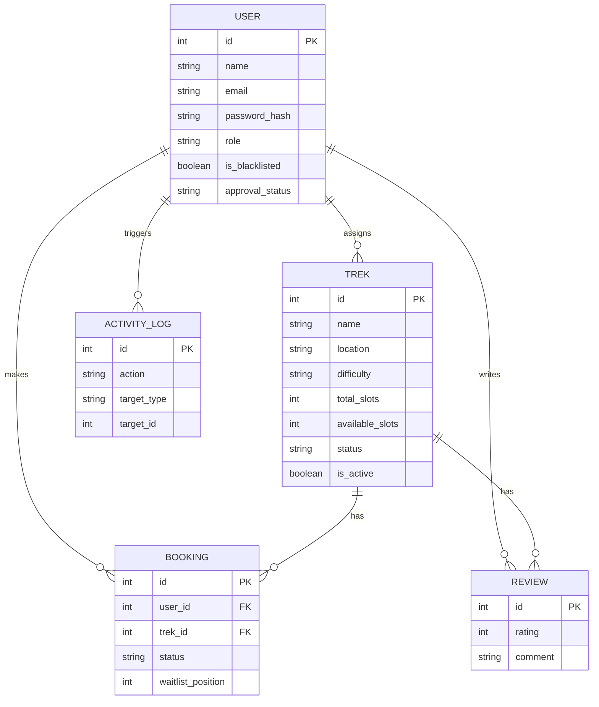

<div align="center">
  <h1>Trekking Management App</h1>
  <p><i>A robust, concurrent-safe, role-based Web Application built with Flask</i></p>
  
  [](#)
  [](#)
  [](#)
  [](#)
  [](#)
</div>

---

## Overview

The **Trekking Management Application** is a monolith web architecture designed to handle end-to-end operations of a trekking agency. It leverages **Flask** for backend routing, **Jinja2** with **Bootstrap 5** for SSR (Server-Side Rendering), and **SQLite** for relational data mapping via SQLAlchemy.

This project focuses heavily on **Role-Based Access Control (RBAC)**, **auditability**, and **transaction safety**, solving classic concurrency issues (e.g., race conditions during booking) right at the database layer.

---

##  Core Features & Technical Highlights

### 1. Multi-Tiered Role-Based Access Control
Implemented via custom decorators (`@admin_required`, `@staff_required`, `@trekker_required`) wrapping Flask-Login's `current_user`:
- **Admin (`sysadmin`)**: Full CRUD over treks, staff approvals, user blacklisting, CSV exports, and global dashboard analytics.
- **Staff**: Manages their assigned treks, dynamically updates trek statuses, and views participants. Accounts require **Admin Approval** before activation.
- **Trekker**: Browses treks, manages bookings (with waitlist capabilities), and submits reviews.

### 2. Concurrent-Safe Booking Engine (Zero Overbooking)
A typical read-modify-write pattern for slot booking is prone to race conditions under load. This app prevents overbooking entirely by avoiding Python-level logic for inventory checks, pushing it to the database engine using **Atomic Conditional Updates**:
```sql
UPDATE treks 
SET available_slots = available_slots - 1
WHERE id = :trek_id AND available_slots > 0;
```
If two simultaneous HTTP requests hit the last slot, the SQLite locking mechanism guarantees only one transaction will match the `available_slots > 0` predicate. The "loser" is automatically placed on the waitlist. Cancellations use the reverse pattern to atomically restore slots and auto-promote waitlisted users via FIFO.

### 3. Comprehensive Audit Trail
Every critical mutation (user blacklisting, staff assignment, approvals) is logged into an `activity_logs` table via a unified `log_activity()` utility, providing a non-repudiable audit trail for system administrators.

### 4. Read-Only RESTful API
Exposes authenticated JSON endpoints under `/api/*` for programmatic access to treks and user data. Fully documented via an **OpenAPI 3.0** specification (`api.yaml`).

---

##  Entity-Relationship Model



---

##  Architecture & Blueprint Routing

The codebase follows the Application Factory pattern for scalability and circular-dependency prevention.

```text
trekking_app/
├── app.py               # Application factory & Blueprint registration
├── config.py            # Environment & DB configurations
├── extensions.py        # SQLAlchemy & Flask-Login singletons
├── models.py            # ORM definitions
├── decorators.py        # RBAC middleware wrappers
├── utils.py             # Helpers (e.g. log_activity)
├── api.yaml             # OpenAPI specification
├── routes/              # Feature-segmented Controllers
│   ├── auth.py          # Session management & Registration
│   ├── admin.py         # Admin Dashboard, CRUD, Approvals, CSV
│   ├── staff.py         # Trek Management & Status Operations
│   ├── trekker.py       # Discovery, Booking, Reviews & Profiles
│   └── api.py           # REST API endpoints
└── templates/           # Jinja2 views (Bootstrap 5 styled)
```

---

##  Getting Started

### Prerequisites
- Python 3.10+
- `pip` and `venv`

### Installation & Execution

1. **Clone & Setup Virtual Environment**
   ```bash
   git clone <repo-url>
   cd trekking_app
   python3 -m venv venv
   
   # Linux/macOS
   source venv/bin/activate
   # Windows
   .\venv\Scripts\activate
   ```

2. **Install Dependencies**
   ```bash
   pip install -r requirements.txt
   ```

3. **Run the Application**
   ```bash
   python app.py
   ```
   > *Note: The SQLite database (`instance/trekking.db`) and the default admin account are automatically provisioned on the first run via SQLAlchemy's `create_all()` hook.*

4. **Access the App**
   Open your browser and navigate to `http://127.0.0.1:5000`
   
   **Default Admin Credentials:**
   - Email: `admin@trek.com`
   - Password: `admin123`

---

##  REST API Endpoints

The app features an integrated REST API for third-party consumption. See `api.yaml` for the full OpenAPI spec.

| Method | Endpoint | Description | Auth Required |
|--------|----------|-------------|---------------|
| `GET` | `/api/treks` | List all active treks | None |
| `GET` | `/api/treks/{id}` | Get specific trek details | None |
| `GET` | `/api/bookings` | List bookings (scoped by role) | Session |
| `GET` | `/api/users` | List all system users | Admin Session |

---

Made by 
Meet Jagtap
24f2003957
